# Event-Driven Feed & Processing System - Architecture

A backend system that handles writes asynchronously using Kafka, generates user feeds via fan-out strategies, and remains correct under retries, crashes, and load spikes using idempotency and backpressure.

---

## Table of Contents

1. [One-Line Definition](#one-line-definition)
2. [Why This System Exists](#why-this-system-exists)
3. [High-Level Architecture](#high-level-architecture)
4. [The Three Planes](#the-three-planes)
5. [Core Components](#core-components)
6. [Data Model](#data-model)
7. [Event Design](#event-design)
8. [Kafka Topics & Partitioning](#kafka-topics--partitioning)
9. [Write Path](#write-path)
10. [Read Path](#read-path)
11. [Fan-Out Strategy](#fan-out-strategy)
12. [Idempotency](#idempotency)
13. [Failure Scenarios](#failure-scenarios)
14. [Backpressure](#backpressure)
15. [Reliability Patterns](#reliability-patterns)
16. [Observability](#observability)
17. [Project Structure](#project-structure)
18. [Tech Stack](#tech-stack)
19. [What This Project Proves](#what-this-project-proves)

---

## One-Line Definition

> A backend system that handles writes asynchronously using Kafka, generates user feeds via fan-out strategies, and remains correct under retries, crashes, and load spikes using idempotency and backpressure.

**If you can't say this cleanly, stop and reread.**

---

## Why This System Exists

### The Naïve Approach (WRONG)


**Problems with synchronous approach:**
- Request latency grows linearly with followers
- One slow DB write blocks everything
- Celebrity with 1M followers = 1M writes per post
- System becomes unusable at scale

### The Real Problem

| Requirement | Why It Matters |
|-------------|----------------|
| Writes should be fast | Users expect instant feedback |
| Work should be async | Heavy processing shouldn't block requests |
| Failures shouldn't lose data | Reliability is non-negotiable |
| Spikes shouldn't kill the DB | Traffic is unpredictable |

**This is why event-driven architecture exists.**

---

## High-Level Architecture


---

## The Three Planes

This architecture separates concerns into three distinct planes. **Keep these separated or the system collapses.**

```mermaid
graph LR
    subgraph "1️⃣ Request Plane"
        direction TB
        R1[Handles User Intent]
        R2[Validates Requests]
        R3[Returns Fast]
    end
    
    subgraph "2️⃣ Event Plane"
        direction TB
        E1[Guarantees Delivery]
        E2[Handles Retries]
        E3[Absorbs Spikes]
    end
    
    subgraph "3️⃣ Processing Plane"
        direction TB
        P1[Does Heavy Work]
        P2[Processes Events]
        P3[Writes to DB]
    end
    
    R1 --> E1 --> P1
```



### Why Separation Matters

| Plane | Responsibility | What It NEVER Does |
|-------|---------------|-------------------|
| **Request** | Validate, authenticate, publish event | Feed generation, heavy DB writes |
| **Event** | Persist events, guarantee delivery | Business logic |
| **Processing** | Fan-out, DB writes, complex logic | Handle user requests directly |

---

## Core Components

### 3.1 API Service (Go)


**Responsibilities:**
- ✅ Validate requests
- ✅ Authenticate users
- ✅ Publish events to Kafka
- ✅ Return response immediately

**What it NEVER does:**
- ❌ Feed generation
- ❌ Heavy DB writes
- ❌ Fan-out logic

*That work belongs elsewhere.*

---

### 3.2 Kafka (Event Backbone)

> **Kafka is not a queue. Kafka is a durable, ordered, replayable log.**


**Responsibilities:**
- ✅ Persist events durably
- ✅ Handle retries automatically
- ✅ Absorb traffic spikes
- ✅ Decouple producers from consumers

**Key Kafka concept:**
```
Kafka decouples ingestion rate from processing rate.
```
*Memorize this.*

---

### 3.3 Consumer Services (Feed Processors)


**They can:**
- ✅ Crash
- ✅ Restart
- ✅ Scale horizontally

**And the system still works.**

---

### 3.4 Storage Layer


**PostgreSQL stores:**
- Posts (permanent)
- Feed entries (per-user)
- Idempotency records

**Redis caches:**
- Hot feeds (frequently accessed)
- Timeline cache (recent posts)

*Same cache-aside logic as typical read-heavy systems.*

---

### 3.5 Dead Letter Queue (DLQ)


**Purpose:**
- ✅ Capture poison messages
- ✅ Prevent system stalls
- ✅ Enable debugging

> **If you don't have DLQ, your system is fragile.**

---

## Data Model

### Database Schema


### SQL Schema

```sql
-- Posts Table: Stores all posts
CREATE TABLE posts (
    post_id BIGINT PRIMARY KEY,        -- Snowflake ID
    author_id VARCHAR(255) NOT NULL,
    content TEXT NOT NULL,
    created_at TIMESTAMP DEFAULT NOW()
);

-- Feeds Table: User's feed entries (fan-out target)
CREATE TABLE feeds (
    user_id VARCHAR(255) NOT NULL,
    post_id BIGINT NOT NULL,
    created_at TIMESTAMP DEFAULT NOW(),
    PRIMARY KEY (user_id, post_id)
);

-- Idempotency Table: Prevents duplicate processing
CREATE TABLE processed_events (
    event_id BIGINT PRIMARY KEY,
    processed_at TIMESTAMP DEFAULT NOW()
);

-- Performance indexes
CREATE INDEX idx_feeds_user_created ON feeds(user_id, created_at DESC);
CREATE INDEX idx_posts_author ON posts(author_id);
```

---

## Event Design

> **This is where juniors fail.**

### Event Schema

```json
{
  "event_id": "7891234567890123456",
  "type": "POST_CREATED",
  "actor_id": "user_123",
  "payload": {
    "post_id": "7891234567890123457"
  },
  "timestamp": 1730000000
}
```

### Why This Structure?

| Property | Purpose |
|----------|---------|
| `event_id` | Unique identifier for idempotency |
| `type` | Enables routing and filtering |
| `actor_id` | Partition key for ordering |
| `payload` | Event-specific data |
| `timestamp` | Ordering and debugging |

**Key principles:**
- ✅ Immutable - events never change
- ✅ Replayable - can rebuild state from events
- ✅ Debuggable - contains all context
- ✅ Extensible - add fields without breaking

> **Never emit "just data". Emit facts.**

---

## Kafka Topics & Partitioning

### Topics

```mermaid
graph TB
    subgraph "Kafka Topics"
        PE[post-events<br/>📝 New posts]
        FE[feed-events<br/>📰 Feed updates]
        DLE[dead-letter-events<br/>☠️ Failed messages]
    end
    
    API[API Service] -->|publish| PE
    Processor[Feed Processor] -->|consume| PE
    Processor -->|publish| FE
    Processor -->|poison| DLE
```



### Partition Strategy

```go
partition_key = actor_id
```

**Why partition by actor_id?**

```mermaid
graph TB
    subgraph "Partition 0"
        E1[user_a: Post 1]
        E2[user_a: Post 2]
        E3[user_a: Post 3]
    end
    
    subgraph "Partition 1"
        E4[user_b: Post 1]
        E5[user_b: Post 2]
    end
    
    E1 --> E2 --> E3
    E4 --> E5
    
    Note1[✅ Ordering guaranteed per user]
    Note2[✅ Parallelism across users]
```



| Benefit | Explanation |
|---------|-------------|
| **Ordering** | All events from same user go to same partition |
| **Parallelism** | Different users processed in parallel |
| **No locks** | Partitions are independent |

**If asked "why not random partition?":**
> "Ordering matters for user actions."

---

## Write Path

### Complete Write Flow


**Key insight:** Latency stays low because no heavy work happens in the request path.

---

## Read Path

### Feed Read Flow


**Same cache-aside pattern as typical read-heavy systems.**

---

## Fan-Out Strategy

### Strategy Comparison


### Comparison Table

| Strategy | Writes | Reads | Best For |
|----------|--------|-------|----------|
| Fan-Out on Write | Heavy | Fast | Normal users (<10K followers) |
| Fan-Out on Read | Light | Heavy | Celebrities (1M+ followers) |
| **Hybrid** | Mixed | Mixed | **Production systems** |

### What We Implement


> This mirrors real Twitter/X tradeoffs.

---

## Idempotency

### The Problem

```mermaid
graph LR
    Kafka -->|Deliver| Consumer
    Consumer -->|Process| DB
    Consumer -->|Crash before commit| X[💥]
    Kafka -->|Redeliver| Consumer
    Consumer -->|Process AGAIN| DB
    
    Note[❌ Duplicate writes!]
```



Kafka provides **at-least-once** delivery:
- Messages may be redelivered after crash
- Retries may cause duplicates

### The Solution


### Code Pattern

```go
func processEvent(event Event) error {
    // 1. Check if already processed
    exists, err := repo.EventProcessed(event.EventID)
    if err != nil {
        return err
    }
    if exists {
        return nil // Skip, already done
    }
    
    // 2. Do the actual work
    if err := doFanOut(event); err != nil {
        return err
    }
    
    // 3. Mark as processed
    if err := repo.MarkProcessed(event.EventID); err != nil {
        return err
    }
    
    return nil
}
```

> **"Consumers are stateless; correctness lives in the data."**
> 
> That's senior-level thinking.

---

## Failure Scenarios

### Scenario 1: Consumer Crashes

```mermaid
sequenceDiagram
    participant Kafka
    participant Consumer
    participant DB
    
    Kafka->>Consumer: Event 1
    Consumer->>DB: Write
    Consumer->>Consumer: 💥 CRASH
    Note over Consumer: Offset NOT committed
    
    Consumer->>Consumer: Restart
    Kafka->>Consumer: Event 1 (redelivered)
    Consumer->>DB: Check idempotency
    DB-->>Consumer: Already processed
    Consumer->>Consumer: Skip
    Consumer->>Kafka: Commit offset
```



**Result:** No data loss, no duplicates. ✅

---

### Scenario 2: Database Slow

```mermaid
graph LR
    Kafka[(Kafka<br/>Buffering events)] --> Consumer[Consumer<br/>Processing slowly]
    Consumer --> DB[(Database<br/>Under load)]
    
    Lag[Consumer Lag Increases]
    Buffer[Kafka Buffers Events]
    NoLoss[No Data Loss ✅]
    
    style Kafka fill:#FF9800,color:#fff
```



**Result:** Consumer lags behind, but Kafka buffers. No data loss. ✅

---

### Scenario 3: Poison Message

```mermaid
graph TD
    Kafka[(Kafka)] --> Consumer[Consumer]
    Consumer --> Try1[Retry 1 ❌]
    Try1 --> Try2[Retry 2 ❌]
    Try2 --> Try3[Retry 3 ❌]
    Try3 --> DLQ[(Dead Letter Queue)]
    DLQ --> Continue[Continue processing other events]
    
    style DLQ fill:#f44336,color:#fff
```



**Result:** Bad message quarantined, system continues. ✅

---

## Backpressure

### Why Kafka Exists

```mermaid
graph TB
    subgraph "Without Kafka"
        C1[Client Spike] --> API1[API] --> DB1[(Database)]
        DB1 --> X[💥 DB Overloaded]
    end
    
    subgraph "With Kafka"
        C2[Client Spike] --> API2[API] --> K[(Kafka)]
        K --> Consumer[Consumer]
        Consumer -->|Controlled Rate| DB2[(Database)]
        DB2 --> OK[✅ DB Protected]
    end
```

**Key sentence:**
> "Kafka decouples ingestion rate from processing rate."

*Memorize this.*

### Backpressure Flow

```mermaid
graph LR
    subgraph "Ingestion (Fast)"
        API[API] -->|1000 events/sec| Kafka[(Kafka)]
    end
    
    subgraph "Processing (Controlled)"
        Kafka -->|100 events/sec| Consumer[Consumer]
        Consumer --> DB[(Database)]
    end
    
    Buffer[Kafka absorbs the difference]
```

---

## Reliability Patterns

### Dead Letter Queue Implementation

```mermaid
flowchart TD
    Consume[Consume Message] --> Process[Process]
    Process -->|Success| Commit[Commit Offset]
    Process -->|Failure| Retry{Retry Count < Max?}
    Retry -->|Yes| Backoff[Exponential Backoff]
    Backoff --> Process
    Retry -->|No| DLQ[Send to DLQ]
    DLQ --> Commit
    
    style DLQ fill:#f44336,color:#fff
```

### Retry Policy

```go
type RetryPolicy struct {
    MaxRetries     int           // e.g., 3
    InitialBackoff time.Duration // e.g., 100ms
    MaxBackoff     time.Duration // e.g., 10s
    Multiplier     float64       // e.g., 2.0
}

// Backoff calculation
// Retry 1: 100ms
// Retry 2: 200ms
// Retry 3: 400ms
// After 3: Send to DLQ
```

---

## Observability

### Mandatory Metrics

```mermaid
graph TB
    subgraph "Prometheus Metrics"
        Lag[kafka_consumer_lag<br/>per partition]
        Duration[event_processing_duration_seconds<br/>histogram]
        Retries[event_retry_total<br/>counter]
        DLQSize[dlq_messages_total<br/>counter]
    end
    
    Consumer[Feed Processor] --> Lag
    Consumer --> Duration
    Consumer --> Retries
    Consumer --> DLQSize
    
    Lag --> Alert1[Alert if lag > threshold]
    DLQSize --> Alert2[Alert if DLQ growing]
```

### Metrics Table

| Metric | Type | Labels | Purpose |
|--------|------|--------|---------|
| `kafka_consumer_lag` | Gauge | topic, partition | Detect falling behind |
| `event_processing_duration_seconds` | Histogram | type | Performance tracking |
| `event_retry_total` | Counter | type | Reliability monitoring |
| `dlq_messages_total` | Counter | - | Failure rate |

> **If you don't monitor lag, you don't understand Kafka.**

---

## Project Structure

```
event-driven-feed/
├── cmd/
│   ├── api/
│   │   └── main.go           # API service entry point
│   └── processor/
│       └── main.go           # Feed processor entry point
│
├── config/
│   └── config.go             # Configuration management
│
├── internal/
│   ├── api/
│   │   ├── handlers/
│   │   │   ├── posts.go      # POST /posts handler
│   │   │   └── feeds.go      # GET /feeds/:id handler
│   │   ├── middleware/
│   │   │   └── auth.go       # Authentication
│   │   └── router.go         # HTTP routing
│   │
│   ├── cache/
│   │   └── redis.go          # Redis client wrapper
│   │
│   ├── dlq/
│   │   └── handler.go        # Dead Letter Queue
│   │
│   ├── events/
│   │   └── schema.go         # Event definitions
│   │
│   ├── kafka/
│   │   ├── producer.go       # Kafka producer
│   │   └── consumer.go       # Kafka consumer
│   │
│   ├── metrics/
│   │   └── prometheus.go     # Prometheus metrics
│   │
│   ├── processor/
│   │   ├── handler.go        # Event processing logic
│   │   └── retry.go          # Retry policies
│   │
│   ├── repository/
│   │   ├── posts.go          # Posts data access
│   │   ├── feeds.go          # Feeds data access
│   │   └── idempotency.go    # Processed events
│   │
│   └── snowflake/
│       └── generator.go      # ID generation
│
├── migrations/
│   └── 001_initial_schema.sql
│
├── docker-compose.yml
├── go.mod
├── go.sum
└── README.md
```

---

## Tech Stack

| Component | Technology | Purpose |
|-----------|------------|---------|
| Language | **Go** | High performance, great concurrency |
| Message Broker | **Kafka** | Event backbone, durability |
| Primary DB | **PostgreSQL** | ACID, reliable storage |
| Cache | **Redis** | Hot data, fast reads |
| Orchestration | **Docker Compose** | Local development |
| Monitoring | **Prometheus** | Metrics collection |

**No extras. No fluff.**

---

## What This Project Proves

After completing this project, interviewers infer:

| Skill | Evidence |
|-------|----------|
| ✅ Async systems | Kafka producer/consumer pattern |
| ✅ Failure reasoning | DLQ, idempotency, retries |
| ✅ Scale design | Fan-out strategies, partitioning |
| ✅ Non-blocking paths | Immediate API response |

### The Jump

> **Project 1 says:** "I build fast systems."
> 
> **Project 2 says:** "I build systems that don't fall apart."

That's the jump from student → engineer.

---

## What NOT to Build

| ❌ Skip | Why |
|---------|-----|
| Frontend | Backend focus |
| OAuth flows | Not the learning goal |
| Microservice explosion | Keep it simple |
| Kubernetes | Docker Compose is enough |

**Depth > Breadth**

---

## MVP vs Phase 2

### MVP (Build First)

- [x] Kafka producer
- [x] Consumer group
- [x] Fan-out logic
- [x] Idempotency
- [x] Basic metrics

### Phase 2 (Later)

- [ ] Dead Letter Queue
- [ ] Advanced retry policies
- [ ] Celebrity optimization (hybrid fan-out)

**Finish MVP first.**

---

## Implementation Order

| Phase | Component | Priority |
|-------|-----------|----------|
| 1 | Docker Compose + Go project | ⭐⭐⭐ |
| 2 | Database schema + repositories | ⭐⭐⭐ |
| 3 | Event schema + Kafka producer | ⭐⭐⭐ |
| 4 | API service (POST /posts) | ⭐⭐⭐ |
| 5 | Feed processor (consumer) | ⭐⭐⭐ |
| 6 | Caching layer | ⭐⭐ |
| 7 | DLQ + retries | ⭐⭐ |
| 8 | Prometheus metrics | ⭐⭐ |

---

## Key Concepts Summary

### Remember These

1. **Three Planes**: Request → Event → Processing
2. **Kafka is a log**, not a queue
3. **Partition by actor_id** for ordering
4. **Idempotency via event_id** for correctness
5. **DLQ for poison messages** for reliability
6. **Cache-aside for reads** for performance
7. **Kafka decouples ingestion from processing** for backpressure

### Interview One-Liners

- "Kafka decouples ingestion rate from processing rate."
- "Consumers are stateless; correctness lives in the data."
- "Ordering matters for user actions."
- "Fan-out on write for normal users, fan-out on read for celebrities."
