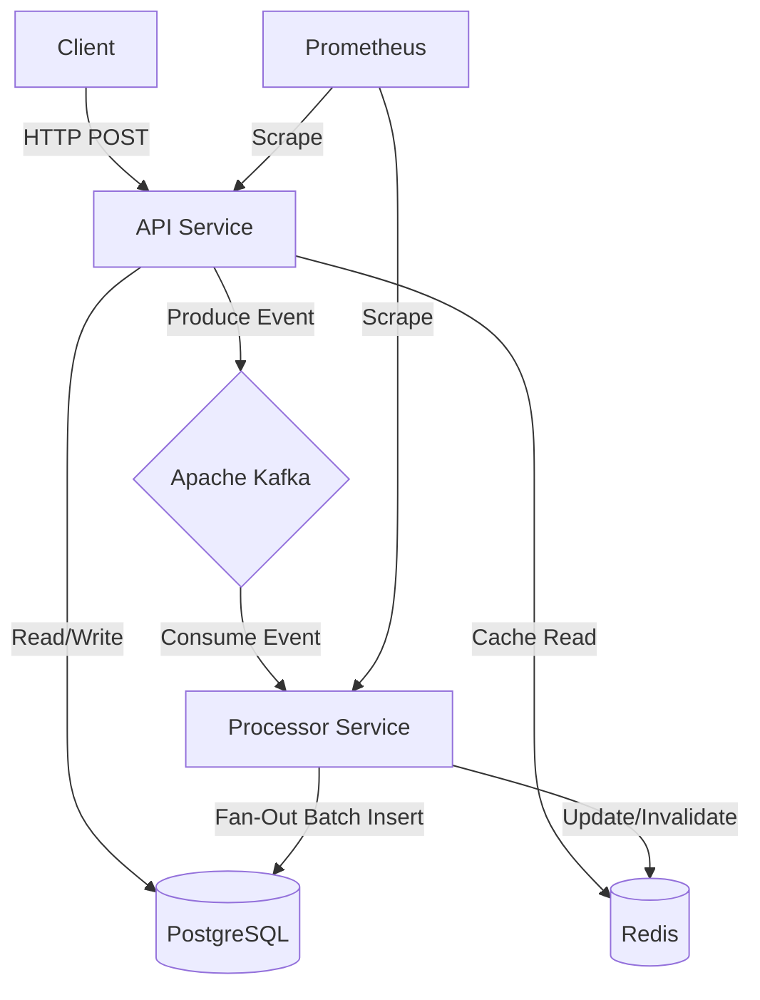

# Event-Driven Feed & Processing System

A high-performance, event-driven social media feed system built for scale. Features **Fan-Out on Write**, **Idempotency**, and **Smart Caching**.


## 🚀 Features

- **⚡ Event-Driven Architecture** - Decoupled services using Kafka for asynchronous processing.
- **📡 Fan-Out on Write** - Efficient pre-computed feeds for high-read throughput.
- **🛡️ Resilience** - Idempotent processing, Dead Letter Queues (DLQ), and Graceful Shutdowns.
- **🚀 Smart Caching** - Redis "Cache-Aside" pattern for hot feeds.
- **📊 Observability** - Prometheus metrics for request rates, latencies, and throughput.

## 🛠️ Quick Start

This project includes a `Makefile` for easy management.

### 1. Start Infrastructure
Starts PostgreSQL, Kafka, Zookeeper, and Redis.
```bash
make infra
```

### 2. Run Services
Run these in separate terminals:

**Terminal 1: API Service**
```bash
make run-api
# Access at http://localhost:8080
```

**Terminal 2: Processor Service**
```bash
make run-processor
```

### 3. Verify System
Runs the End-to-End test to verify the full flow (Post -> Kafka -> Processor -> DB).
```bash
make test
```

## 🏗️ Architecture



## ⚡ Performance Benchmarks

Tested on a single development machine (MacBook Air M4) with all services running locally via Docker.

| Metric | Throughput | Latency (Avg) | Notes |
|--------|------------|---------------|-------|
| **Write (Create Post)** | **~1,200 RPS** | ~80ms | Async processing via Kafka |
| **Read (Get Feed)** | **~3,800 RPS** | ~5ms | **Redis Cache-Aside** Hit |

> System demonstrates high read scalability due to caching and decoupled write/fan-out architecture.

## 📝 API Endpoints

| Method | Endpoint | Description |
|--------|----------|-------------|
| `POST` | `/posts` | Create a new post (Triggers Event) |
| `GET` | `/feeds/{user_id}` | Get user's feed (Cached) |
| `POST` | `/follow` | Follow a user |
| `GET` | `/metrics` | Prometheus Metrics |

## 🔍 Debugging & Tools

**DLQ Inspector**
View failed messages in the Dead Letter Queue:
```bash
make dlq
```
